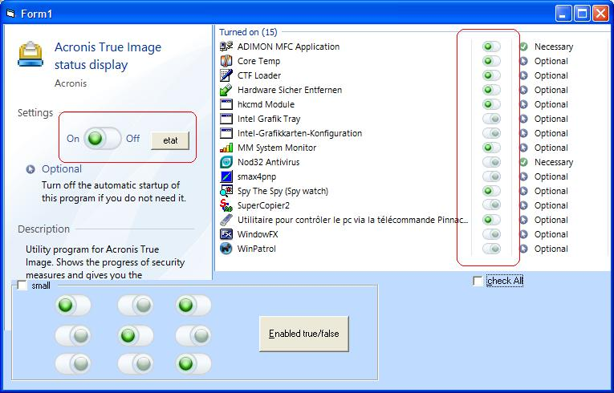

## MM CheckBox

### Description

A Very simple and beautiful CheckBox (see screen shot)
 
### More Info
 

             |
---                |---
**Submitted On**   |2008-12-13 21:50:22
**By**             |[Simo Simo](https://github.com/Planet-Source-Code/PSCIndex/blob/master/ByAuthor/simo-simo.md)
**Level**          |Beginner
**User Rating**    |5.0 (15 globes from 3 users)
**Compatibility**  |VB 6\.0
**Category**       |[OLE/ COM/ DCOM/ Active\-X](https://github.com/Planet-Source-Code/PSCIndex/blob/master/ByCategory/ole-com-dcom-active-x__1-29.md)
**World**          |[Visual Basic](https://github.com/Planet-Source-Code/PSCIndex/blob/master/ByWorld/visual-basic.md)
**Archive File**   |[MM\_CheckBo21381712252008\.zip](https://github.com/Planet-Source-Code/simo-simo-mm-checkbox__1-71566/archive/master.zip)

### API Declarations

RoundRect,CreateRoundRectRgn

